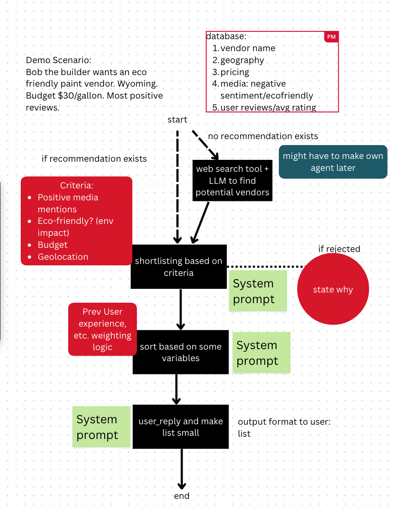
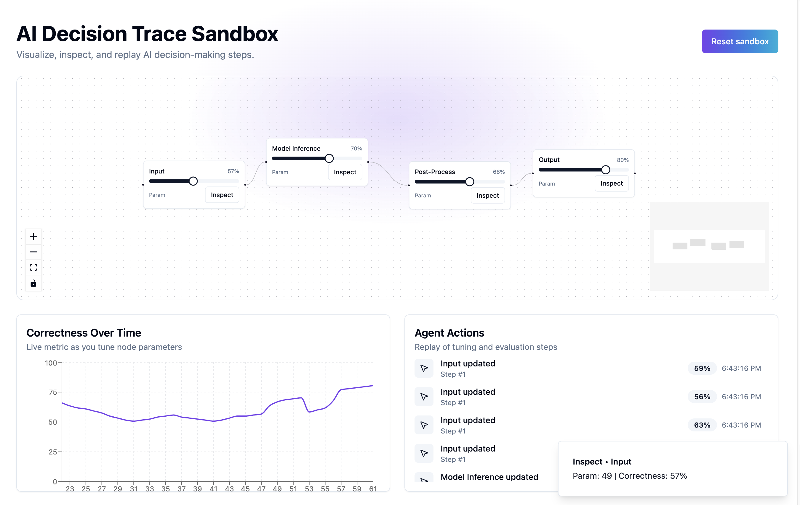

# AgentOps - Agentic Workflow Visualization & Audit Platform

## Overview

AgentOps is a powerful tool for visualizing, auditing, and understanding complex agentic workflows. Built with cutting-edge technologies including LangGraph for workflow orchestration, React 18 with Concurrent Mode, and TypeScript for type safety, it provides unprecedented transparency into AI decision-making processes, making them auditable and compliance-ready.

**Demo Use Case**: Bob the Builder selects eco-friendly paint from 1,200+ vendors while avoiding high carbon scores, non-transparent supply chains, and illegal sourcing. This demonstrates how AgentOps can track and visualize complex decision-making workflows with multiple compliance parameters.



## Features

- **Workflow Visualization**: Interactive node-based visualization of agentic workflows
- **Deterministic Replay**: Replay and audit multi-agent decision processes
- **Compliance Monitoring**: Real-time flagging of compliance issues with reasoning inspection
- **Decision Reports**: Detailed reports of agent decisions and reasoning
- **Benchmarking**: Compare different workflow executions and agent behaviors



## Tech Stack

### Core Technologies
- **LangGraph** - Framework for building and visualizing stateful, multi-actor applications
- **React 18** - Frontend library for building interactive visualizations
- **TypeScript** - Type-safe JavaScript for reliable development

- **XYFlow** - Interactive node-based workflow visualization

### Frontend
- **TypeScript** - Type-safe JavaScript for robust development
- **Vite** - Next Generation Frontend Tooling with lightning-fast HMR
- **shadcn/ui** - Beautifully designed, accessible components
- **Tailwind CSS** - Utility-first CSS framework for rapid UI development
- **React Query** - Powerful data synchronization and state management
- **Framer Motion** - Production-ready animation library for React

### Backend/AI
- **Python 3.10+**
- **LangChain** - Framework for developing applications powered by language models
- **Azure OpenAI** - For natural language processing and reasoning
- **Custom Compliance Engine** - Real-time compliance checking and flagging

## Getting Started

### Prerequisites

- Node.js 18+ and npm
- Python 3.10+
- Azure OpenAI API key (or other LLM provider)

### Installation

1. **Clone the repository**
   ```bash
   git clone <repository-url>
   cd AgentOps
   ```

2. **Install frontend dependencies**
   ```bash
   npm install
   ```

3. **Set up Python environment**
   ```bash
   python -m venv venv
   source venv/bin/activate  # On Windows: venv\Scripts\activate
   pip install -r requirements.txt
   ```

4. **Environment Variables**
   Create a `.env` file in the root directory with the following variables:
   ```
   OPENAI_API_KEY=your_openai_api_key
   AZURE_OPENAI_ENDPOINT=your_azure_endpoint
   AZURE_OPENAI_API_KEY=your_azure_api_key
   ```

### Running the Application

1. **Start the development server**
   ```bash
   # In one terminal
   npm run dev
   
   # In another terminal
   python langgraph_workflow_skeleton.py
   ```

2. **Build for production**
   ```bash
   npm run build
   ```

## Project Structure

```
AgentOps/
├── src/                    # Frontend source code
│   ├── components/         # Reusable UI components
│   │   ├── workflow/      # Workflow visualization components
│   │   ├── compliance/    # Compliance visualization components
│   │   └── reports/       # Report generation components
│   ├── pages/             # Application pages
│   ├── lib/               # Utility functions and API clients
│   └── styles/            # Global styles
├── public/                # Static assets
├── data/                  # Sample datasets and workflow examples
│   ├── vendor-selection/  # Demo: Vendor selection workflow
│   └── compliance-rules/  # Compliance rules and validators
├── workflows/             # LangGraph workflow definitions
├── scripts/               # Utility scripts
└── docs/                  # Documentation and examples
```

## Demo Use Case: Vendor Selection Workflow

Our demo showcases how AgentOps can track and visualize complex decision-making processes:

**Scenario**: Selecting eco-friendly paint vendors while considering multiple compliance factors
- **Dataset**: 1,200+ vendors with detailed profiles
- **Compliance Parameters**:
  - Carbon footprint scoring
  - Supply chain transparency
  - Legal sourcing verification
  - Environmental impact metrics

**Features Demonstrated**:
- Real-time compliance flagging
- Decision reasoning visualization
- Narrative report generation
- Workflow replay and audit

## Development

### Getting Started

1. **Clone the repository**
   ```bash
   git clone https://github.com/yourusername/AgentOps.git
   cd AgentOps
   ```

2. **Install dependencies**
   ```bash
   npm install
   pip install -r requirements.txt
   ```

3. **Set up environment variables**
   Create a `.env` file with your API keys:
   ```
   OPENAI_API_KEY=your_key
   ELEVENLABS_API_KEY=your_key
   ```

### Available Scripts

- `npm run dev` - Start development server
- `npm run build` - Build for production
- `npm run lint` - Run ESLint
- `npm run test` - Run tests
- `python -m workflows.vendor_selection` - Run the vendor selection demo

### Code Style & Standards

- TypeScript: Airbnb style guide
- Python: PEP 8 guidelines
- Pre-commit hooks for code quality
- Comprehensive docstrings for all functions

## Contributing

1. Fork the repository
2. Create your feature branch (`git checkout -b feature/amazing-feature`)
3. Commit your changes (`git commit -m 'Add some amazing feature'`)
4. Push to the branch (`git push origin feature/amazing-feature`)
5. Open a Pull Request

## Roadmap

### Next 24 Hours (If We Had Them)
- Multi-agent branching comparisons
- Richer vendor profiles with embedded documentation
- Exportable compliance audit PDFs
- Enhanced visualization for complex decision trees

### Future Enhancements
- Support for additional workflow frameworks
- Custom compliance rule builder
- Team collaboration features
- Advanced analytics dashboard

## License

This project is licensed under the MIT License - see the [LICENSE](LICENSE) file for details.

## Support

For support or feature requests, please open an issue in the [GitHub repository](https://github.com/yourusername/AgentOps).

## Team

AgentOps was developed by a team of AI engineers and product designers passionate about making AI workflows transparent and auditable.

